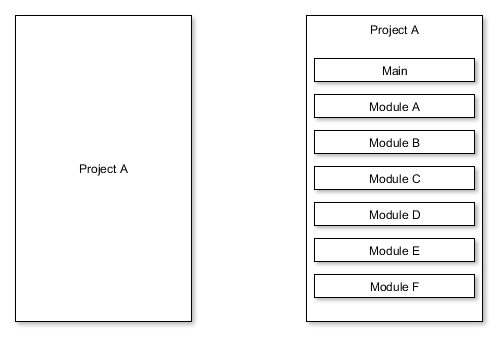
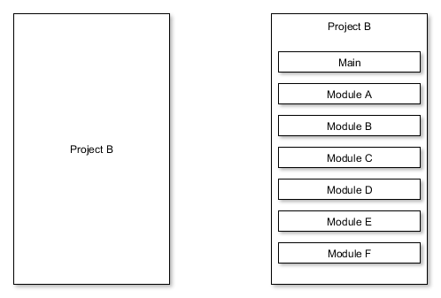
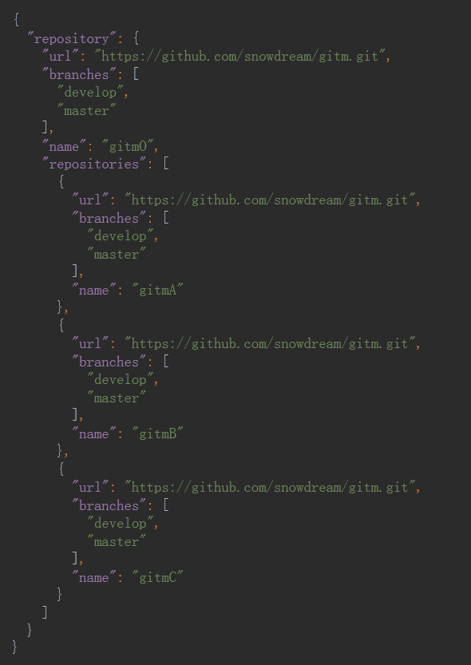
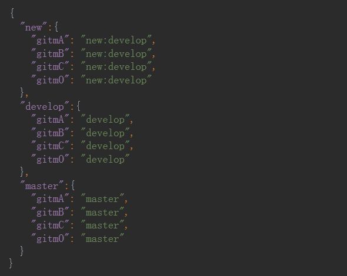

#gitm
  [![NPM Version][npm-image]][npm-url]
  [![NPM Downloads][downloads-image]][downloads-url]

## Introduction
A simple but useful tool to manage multiple git repositories.     
Be similar to repo, git submodule.

## System requirements
Node.js v0.12.0+

## Installation
```bash
npm install gitm -g
```

## Scene
### Scene One


If you have a project A on the left.          
Now, you want to modularize it to the project A on the right.

For the project A on the left, It is a git repository.        
For the project A on the right, project A is not a git repository, project Main and project Module ** are all git repositories.

Browse the example at [repositories](examples/repositories)

### Scene Two


If you have a project B on the left.          
Now, you want to modularize it to the project B on the right.

For the project B on the left, It is a git repository.         
For the project B on the right, project B, project Main and project Module ** are all git repositories.

Browse the example at [repository](examples/repository)

## Config  
Usually, gitm needs two config files. **repo.gitm** and  **branch.gitm**   

### **repo.gitm** 


1. **repository**, required，represent the outermost project is a git repository.
1. **url**, required，represent url for the git repository.
1. **branches**, optional，represent local branches for the git repository. the first branch will be the default branch.
1. **name**, optional，represent local name for the git repository. if this is not provided, then try to guess it from the url.
1. **repositories**, optional，represent the git repository has sub git repositories.

### **branch.gitm** 


1. **new/develop/master**, required，represent the group name of the branches.
1. **gitmA**, required，represent local name for the git repository.
1. **new:develop**, **new** is required，**develop** is optional，**new** represent local branch for the git repository. **develop** represent the local branch **new** may be created from the branch **develop** or the branch **origin/develop**.

## Usage
**Warning: All the commands as follows should be executed in the root path.**
**For Scene One, the root path is Project A.**
**For Scene Two, the root path is Project B.**

### gitm init   
* If **repo.gitm** does not exist in the root path, try to create it.
* If **branch.gitm** does not exist in the root path, try to create it.
* If **.gitignore** does not exist in every git repository, try to create it. If sub git repository exist, try to add them name into the file .gitignore.

### gitm clone
```bash
gitm clone
```
Read the file **repo.gitm** in the current directory, and clone every git repository.     
If the property **branches** exist, every branch will be checkout. The fisrt branch will be the default branch.

```bash
gitm clone https://raw.githubusercontent.com/snowdream/gitm/master/examples/repository/repo.gitm
```
Read the file **repo.gitm** from the url, other operation is the same as the command `gitm clone`

### gitm checkout [name]

Check the file  **branch.gitm**，if the **name** does not exist in the names of group, then `git checkout [name]` will be executed in every git repository.else deal it with the following rules.

```bash
gitm checkout new
```
`git checkout new` will be executed in every git repository. such as **gitmA**.
1. if the branch **new** exist, excute `git checkout new`
1. if the branch **origin/new** exist, excute `git checkout –b new origin/new`
1. if the branch **develop** exist, excute `git checkout –b new develop`
1. if the branch **origin/develop** exist, excute `git checkout –b new origin/develop`
1. if all the branch up does not exist, excute `git checkout –b new`
All the steps will be taken in order. once a step has been taken, then the command is finished, and the rest steps will not be taken.

### gitm fetch
```bash
gitm fetch
```
Check the file  **repo.gitm**，execute the following command in every git repository.   
```bash
git fetch --all --progress -v
```

If `gitm fetch` has any other parameters, such as `gitm fetch origin master`
Then `git fetch origin master` will be executed in every git repository.

### gitm pull
```bash
gitm pull
```
Check the file  **repo.gitm**，execute the following command in every git repository.   
```bash
git pull origin branch --progress -v
```
**branch** is the current branch of the git repository.

If `gitm pull` has any other parameters, such as `gitm pull origin master`
Then `git pull origin master` will be executed in every git repository.

### gitm push
```bash
gitm push
```
Check the file  **repo.gitm**，execute the following command in every git repository.   
```bash
git push origin branch:branch --progress -v
```
**branch** is the current branch of the git repository.

If `gitm push` has any other parameters, such as `gitm push origin master`
Then `git push origin master` will be executed in every git repository.


### gitm help [cmd]
Such as `gitm help clone`. It will execute the following command only once.
```bash
git help clone
```

### gitm -h  / gitm --help 
show helps for gitm

### gitm -V  / gitm --version 
show version for gitm

###  Other git commands which have not been list here, such as `gitm tag v0.1`
Use git in place of gitm, then execute the command in every git repository. 


## License
```
Copyright (C) 2014 Snowdream Mobile <yanghui1986527@gmail.com>

Licensed under the Apache License, Version 2.0 (the "License");
you may not use this file except in compliance with the License.
You may obtain a copy of the License at

        http://www.apache.org/licenses/LICENSE-2.0

Unless required by applicable law or agreed to in writing, software
distributed under the License is distributed on an "AS IS" BASIS,
WITHOUT WARRANTIES OR CONDITIONS OF ANY KIND, either express or implied.
See the License for the specific language governing permissions and
limitations under the License.
```

[npm-image]: https://img.shields.io/npm/v/gitm.svg
[npm-url]: https://npmjs.org/package/gitm
[downloads-image]: https://img.shields.io/npm/dm/gitm.svg
[downloads-url]: https://npmjs.org/package/gitm